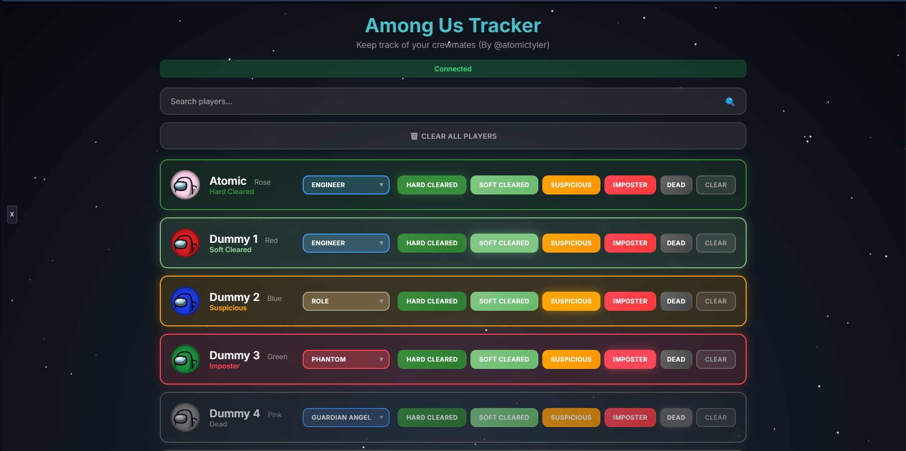

# Journal-AmongUs [REACTOR MOD]

## DISCLAIMER: OPENS *localhost:8080*. May break with modded colors, I couldn't get a stable version while trying to do dynamic coloring.

Do you struggle to keep track of crewmates?

> "Hey, who's clear?"
> "Who did medbay scan again?"

Well, you're in luck! I made this mod to keep track of crewmates (OR imposters) too!
This also works well with imposters as you can keep track of who's been hard cleared and slowly kill them off.

This mod creates a local host on port `:8080`, so if you have any other localhosts running, closing them down would probably be a good idea.

## Preview

## Installation Guide

Go to the [releases page.](https://github.com/AtomicTyler1/AmongUs-Tracker/releases)

If you already have BepInEx and React, then you can just download the `Journal-AmongUs.dll`.
Else Download the Journal-AmongUs.zip which contains BepInEx, Reactor and this mod.

You can find the download to reactor [here](https://github.com/NuclearPowered/Reactor/releases)

## Versioning guide

Currently, this has only been tested on the latest version of among us, it may work on older versions, if it doesnt feel free to make an issue. Please provide a log and the game version when giving an issue.

## Getting in contact

If you want to create new features or get in contact with me, create an issue without the issue tag or reach out to me on discord `@atomictyler`. Please do not just say hi, give your reason for contacting me.
This project is something I made just for me, so it's not a top priority to update it. Feel free to make pull/merge requests and help me out if you want updates/changes.

**I have only released this mod because people in the React discord found it a great idea.**